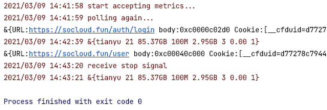
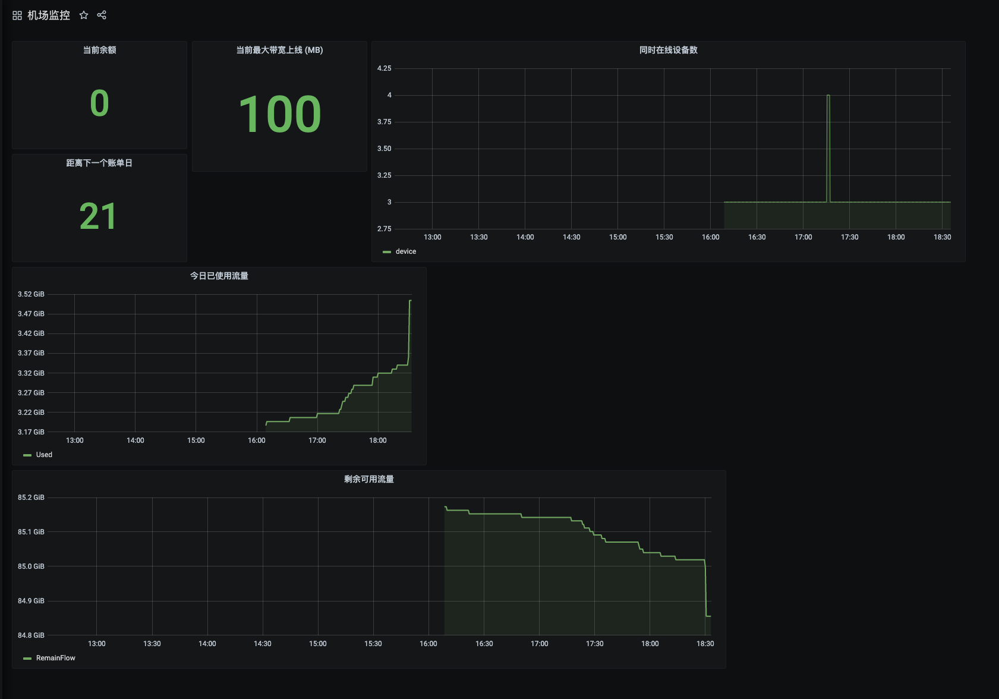

# airflow

## 简介
这是一个对机场的用户信息监控插件，目前的定位是编写成一个轻量化的爬虫，对自己的账户进行一个轮询，同时可以配置 Grafana 进行可视化信息，或者告警等

## 使用测试
```shell
./airflow . --domain https://socloud.fun --username 123456@gmail.com --password "123456" 
{"ret":1,"msg":"\u767b\u5f55\u6210\u529f"}
&{Name:tianyu RemainTime:23 RemainFlow:90.03GB MaxBandwidth:100M TodayUsed:431.9MB OnlineDevice:3 Balance:0.00 Level:1}
```

### 目前可以下面机场模板进行监控
* malio
* realnode(开发中)
---
## 演示
终端日志显示  



metrics 指标显示  


Grafana 展示  

